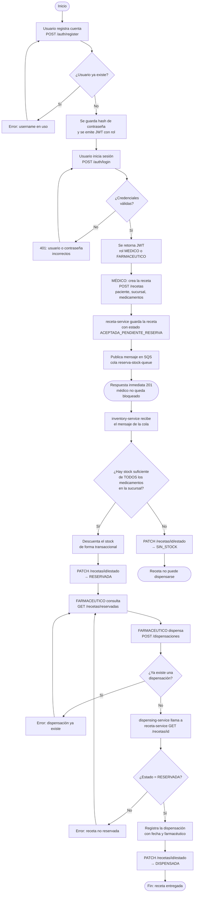
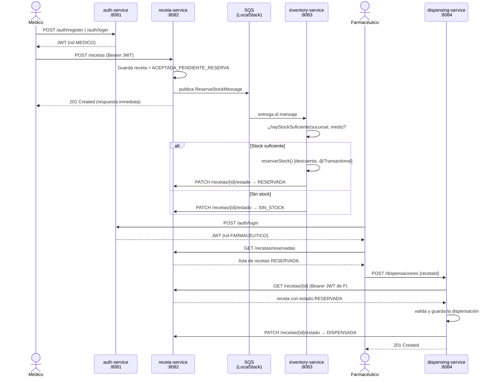

# RecetaYA — Resumen del proyecto

> Documento de orientación para el equipo. Explica qué es el proyecto, cómo está armado,
> cómo fluye una receta de principio a fin y cómo levantarlo.

---

## 1. ¿Qué es RecetaYA?

**RecetaYA** es una plataforma de gestión de recetas médicas para farmacias, construida con
**arquitectura de microservicios**. Permite que:

- Un **médico** registre una receta con los medicamentos y cantidades que receta.
- El sistema **reserve automáticamente el stock** en la sucursal indicada (o detecte falta de stock).
- Un **farmacéutico** vea las recetas con stock reservado y **dispense** los medicamentos.

El objetivo principal es **digitalizar y desacoplar** el proceso de recetar → reservar stock → dispensar,
para que cada parte del sistema evolucione de forma independiente.

---

## 2. Stack tecnológico

| Capa | Tecnología |

|---|---|
| Lenguaje | Java 17+ |
| Framework | Spring Boot 3 (Spring Web, Spring Security, Spring Data JPA) |
| Autenticación | JWT (JSON Web Tokens) con roles |
| Bases de datos | PostgreSQL 16 (una por servicio) |
| Comunicación asíncrona | AWS SQS (emulado localmente con **LocalStack**) |
| Comunicación sincrona | REST (RestClient entre servicios) |
| Contenedores | Docker + Docker Build |
| Orquestación | Docker Compose |
| Build | Maven (wrapper `mvnw`) |
| Mapeo | Lombok |

---

## 3. Arquitectura: los 5 servicios

```                       ┌─────────────────────┐
                          │    auth-service     │  :8081
                          │  Login/Register     │
                          │   emite JWT         │
                          └──────────┬──────────┘
                                    token JWT (roles MEDICO / FARMACEUTICO)
                                      ▼
┌──────────────┐  REST   ┌─────────────────────┐  REST   ┌─────────────────────┐
│   receta-    │◄────────│  inventory-service  │◄────────│  dispensing-service │
│   service    │         │      :8083          │         │       :8084         │
│    :8082     │         └──────────┬──────────┘         └─────────────────────┘
└──────┬───────┘                    │
       │ publica mensaje            │ escucha
       ▼                            ▼
   ┌───────────────────────────────────────┐
   │        SQS (LocalStack) :4566         │
   │        cola: reserva-stock-queue      │
   └───────────────────────────────────────┘

   ┌─────────────────────┐
   │ notification-service│  :8085  ← esqueleto, aún sin lógica
   └─────────────────────┘
```

### Tabla de servicios

| Servicio | Puerto | Base de datos | Responsabilidad |

|---|---|---|---|
| `auth-service` | 8081 | `auth_db` (5433) | Registro/login de usuarios, emisión y validación de JWT |
| `receta-service` | 8082 | `receta_db` (5434) | CRUD de recetas, publica eventos de reserva de stock |
| `inventory-service` | 8083 | `inventory_db` (5435) | Stock por sucursal, reserva de stock al recibir el mensaje SQS |
| `dispensing-service` | 8084 | `dispensing_db` (5436) | Registra la entrega (dispensación) de recetas |
| `notification-service` | 8085 | — | **Pendiente**: hoy solo existe el esqueleto Spring Boot |

Infraestructura auxiliar:

- **4 bases PostgreSQL** (una por servicio → *database per service*).
- **LocalStack** (puerto 4566): emula AWS SQS en local para no depender de una cuenta AWS.

---

## 4. Roles y permisos

Dos roles, definidos en `auth-service` (`Role.java`) y aplicados en el `SecurityConfig` de cada servicio:

| Rol | Puede |

|---|---|
| **MEDICO** | Crear recetas (`POST /recetas`), ver recetas por id |
| **FARMACEUTICO** | Ver recetas reservadas (`GET /recetas/reservadas`), dispensar (`POST /dispensaciones`) |
| Cualquiera autenticado | Consultar/CRUD de inventario (`/inventario/**`) |

> Todas las rutas exigen `Authorization: Bearer <token>` (excepto `/auth/**` y `/actuator/**`).
> El endpoint `PATCH /recetas/{id}/estado` está **abierto** porque lo usan los servicios entre sí
> (es un punto a endurecer: debería autenticarse con un token de servicio).

---

## 5. Estados de una receta

```ACEPTADA_PENDIENTE_RESERVA ──► RESERVADA ──► DISPENSADA
           │
           └──────► SIN_STOCK
```

| Estado | Significado | Quién lo cambia |

|---|---|---|
| `ACEPTADA_PENDIENTE_RESERVA` | Receta creada, aún sin verificar stock | `receta-service` al crear |
| `RESERVADA` | Hay stock suficiente y ya fue descontado | `inventory-service` |
| `SIN_STOCK` | No había stock suficiente en la sucursal | `inventory-service` |
| `DISPENSADA` | El farmacéutico entregó los medicamentos | `dispensing-service` |

---

## 6. Diagrama de flujo del proceso principal



### Diagrama de secuencia (vista técnica)



---

## 7. APIs principales

### auth-service — `:8081`

| Método | Ruta | Descripción |

|---|---|---|
| POST | `/auth/register` | Crea usuario (username, password, nombreCompleto, role) y retorna JWT |
| POST | `/auth/login` | Valida credenciales y retorna JWT |

### receta-service — `:8082`

| Método | Ruta | Rol | Descripción |

|---|---|---|---|
| POST | `/recetas` | MEDICO | Crea receta y dispara la reserva de stock |
| GET | `/recetas/reservadas` | FARMACEUTICO | Lista recetas con stock reservado |
| GET | `/recetas/{id}` | MEDICO / FARMACEUTICO | Detalle de receta |
| PATCH | `/recetas/{id}/estado` | interno | Cambia el estado (lo usan inventory y dispensing) |

### inventory-service — `:8083`

| Método | Ruta | Rol | Descripción |

|---|---|---|---|
| POST | `/inventario` | autenticado | Crea o actualiza stock (medicamento + sucursal) |
| GET | `/inventario` | autenticado | Lista todo el stock |
| GET | `/inventario/{id}` | autenticado | Stock por id |
| PUT | `/inventario/{id}` | autenticado | Actualiza stock |
| DELETE | `/inventario/{id}` | autenticado | Elimina stock |
| — | listener SQS | — | Escucha `reserva-stock-queue` y reserva/amarra stock |

### dispensing-service — `:8084`

| Método | Ruta | Rol | Descripción |

|---|---|---|---|
| POST | `/dispensaciones` | FARMACEUTICO | Dispensa una receta (debe estar RESERVADA) |

---

## 8. Cómo levantar el proyecto

### Prerrequisitos

- Docker Desktop instalado y corriendo
- Git
- Una cuenta gratuita en https://app.localstack.cloud (necesaria para obtener un
  Auth Token, ya que LocalStack lo exige incluso en su plan gratuito)

### 1. Clonar el repositorio

```bash
git clone https://github.com/BenjaminSegovia/RecetasYa.git
cd RecetasYa
```

### 2. Configurar el token de LocalStack

Crea un archivo `.env` en la raíz del proyecto (junto a `docker-compose.yml`):

```bash
LOCALSTACK_AUTH_TOKEN=tu_token_aqui
```

> Este archivo está en `.gitignore` — cada persona que clone el proyecto
> necesita generar su propio token gratuito en app.localstack.cloud.
> Docker Compose lo lee automáticamente al hacer `docker compose up`.

### 3. Levantar todo

```bash
# 1. Levanta todo (bases de datos, LocalStack y los 4 servicios)
docker compose up --build

# 2. Verifica
# auth-service       http://localhost:8081
# receta-service     http://localhost:8082
# inventory-service  http://localhost:8083
# dispensing-service http://localhost:8084
# LocalStack SQS     http://localhost:4566
```

### 4. Crear la cola SQS (una sola vez)

LocalStack arranca sin colas creadas. Con el paso 3 corriendo, abre **otra terminal** y ejecuta:

```bash
docker exec -it localstack awslocal sqs create-queue --queue-name reserva-stock-queue

# Verificar que quedó creada
docker exec -it localstack awslocal sqs list-queues
```

> Hazlo **antes de crear la primera receta**: si la cola no existe, `receta-service`
> no puede publicar el mensaje de reserva de stock.
> La cola vive en el volumen `localstack-data`; si ejecutas `docker compose down -v`
> hay que volver a crearla.

Para correr un servicio en local (fuera de Docker):

```bash
cd receta-service
./mvnw spring-boot:run     # en Windows: mvnw.cmd spring-boot:run
```

### Prueba rápida de punta a punta

```bash
# 1. Registrar un médico
curl -X POST http://localhost:8081/auth/register \
  -H "Content-Type: application/json" \
  -d '{"username":"medico1","password":"secret123","nombreCompleto":"Dr. Prueba","role":"MEDICO"}'

# 2. Registrar un farmacéutico
curl -X POST http://localhost:8081/auth/register \
  -H "Content-Type: application/json" \
  -d '{"username":"farma1","password":"secret123","nombreCompleto":"Farma Prueba","role":"FARMACEUTICO"}'

# 3. Cargar stock (con el JWT de cualquier usuario)
curl -X POST http://localhost:8083/inventario \
  -H "Authorization: Bearer <TOKEN>" -H "Content-Type: application/json" \
  -d '{"nombreMedicamento":"Ibuprofeno 400mg","sucursal":"Santiago Centro","cantidadDisponible":100}'

# 4. Crear la receta (JWT del médico)
curl -X POST http://localhost:8082/recetas \
  -H "Authorization: Bearer <TOKEN_MEDICO>" -H "Content-Type: application/json" \
  -d '{"pacienteNombre":"Juan Pérez","sucursal":"Santiago Centro",
       "medicamentos":[{"nombreMedicamento":"Ibuprofeno 400mg","cantidad":2}]}'

# 5. Ver recetas reservadas (JWT del farmacéutico)
curl http://localhost:8082/recetas/reservadas -H "Authorization: Bearer <TOKEN_FARMA>"

# 6. Dispensar (JWT del farmacéutico)
curl -X POST http://localhost:8084/dispensaciones \
  -H "Authorization: Bearer <TOKEN_FARMA>" -H "Content-Type: application/json" \
  -d '{"recetaId":1}'
```

---

## 9. Convenciones de código

Cada servicio sigue la misma estructura por capas:

```src/main/java/cl/duoc/<servicio>/
├── controller/    → expone la API REST
├── service/       → lógica de negocio
├── repository/    → acceso a datos (Spring Data JPA)
├── model/         → entidades JPA
├── dto/           → objetos de entrada/salida
├── security/      → SecurityConfig + JwtService
├── config/        → configuración (p. ej. SqsConfig)
├── exception/     → excepciones + manejo de errores
└── messaging/     → listeners SQS (solo inventory-service)
```

Paquete base: `cl.duoc.<nombre-servicio>`.

---

## 10. Estado actual y pendientes

**Funciona hoy:**

- Registro/login con JWT y control de roles.
- Ciclo completo: crear receta → reserva de stock por SQS → dispensación.
- 4 servicios contenedorizados con `docker compose up --build`.

**Pendiente / puntos a mejorar:**

1. **`notification-service` está vacío** (solo el esqueleto) y **no está en el `docker-compose.yml`**.
   Su `application.yaml` ya apunta a la cola `reserva-stock-queue`: la idea es notificar al médico
   cuando la receta queda `RESERVADA` o `SIN_STOCK`.
2. **No hay frontend.** Hoy todo se consume vía API REST.
3. **`PATCH /recetas/{id}/estado` está `permitAll`**: debería exigir un token de servicio.
4. **No hay semillas de datos** (usuarios ni stock iniciales): hay que registrarlos a mano.
5. **`INVENTORY_SERVICE_URL` está configurado en dispensing-service pero no se usa** en el código;
   hoy el stock no se vuelve a descontar ni conciliar al dispensar.
6. **Faltan tests**: solo existe el test de arranque (`*ApplicationTests`) de cada servicio.
7. **JWT_SECRET y credenciales están hardcodeados** en el `docker-compose.yml`; usar variables de entorno.
8. No hay API Gateway: cada cliente debe conocer los 4 puertos.
